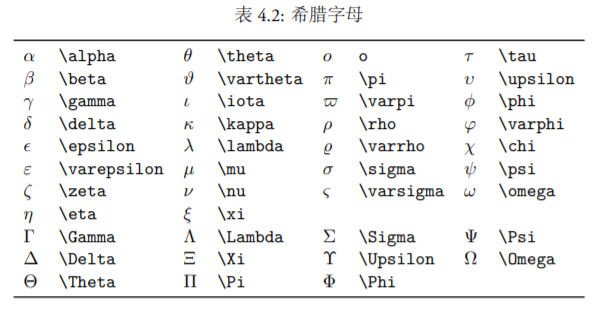

## 基本
* 换行：`\\`

## 数学公式相关

* 数学模式：行内模式（inline） & 行间模式（display，又称独立模式）

    注意：以下方式，markdown中都只支持第一种

    * 行内模式：

        $ ... $ 或 \\( ... \\)
        
        示例：$a^2=b^2+c^2$
        
        公式中间不可有空格，空格用以下方式：

        需求 | 方法 | 效果 | 备注
        ---- | ---- | ---- | ----
        两个quad空格 | a \qquad b | $a \qquad b$ | 两个m的宽度
        quad空格 | a \quad b | $a \quad b$ | 一个m的宽度
        大空格 | a\ b | $a\ b$ | 1/3m宽度
        中等空格 | a\;b | $a\;b$ | 2/7m宽度
        小空格 | a\,b | $a\,b$ | 1/6m宽度
        没有空格 | ab | $ab\,$ |
        紧贴 | a\!b | $a\!b$ | 缩进1/6m宽度

    * 行间模式：

        * 无编号：\$$ ... $$ 或 \\[ ... \\]
        
            示例：

            $$ E=mc^2 $$

        * 有编号：\begin{equation} ... \end{equation}

            示例：
            
            \begin{equation}
            x^n+y^n=z^n
            \end{equation}

* 基本元素：

    * 希腊字母：

        

    * 上下标和根号：

        * 上标用 `^` 表示，下标用 `_` 表示，根号用 `\sqrt` 表示。上下标如果多于一个字母或符号，需要用一对 `{}` 括起来。

            示例：

            $$x_{ij}^2\quad \sqrt{x}\quad \sqrt[3]{x} $$

    * 分数：
    
        分数用 `\frac` 命令表示，它会根据环境自动调整字号，比如在行间公式中会小一点，在独立公式中则大一点。我们可以人工设置分数字号，比如\dfrac 命令把分数的字号设置为独立公式中的大小，而 \tfrac 命令则把字号设为行间公式中的大小。

        示例：

        $\frac{1}{2}\dfrac{1}{2}$

        $$ \frac{1}{2} \tfrac{1}{2} $$

    * 运算符：

        运算 | 方法 | 效果 | 运算 | 方法 | 效果
        ---- | -----|---- | ---- | -----|----
        正负号 | \pm | $\pm$ | 乘 | \times | $\times$
        除 | \div | $\div$ | 点乘 | \cdot | $\cdot$
        并 | \cup | $\cup$ | 交 | \cap | $\cap$
        大于或等于 | \geq | $\geq$ | 小于或等于 | \leq | $\leq$
        不等于 | \neq | $\neq$ | 约等于 | \approx | $\approx$
        恒等于 | \equiv | $\equiv$
        累加 | \sum_{i=1}^n | $\sum_{i=1}^n$ | 累加 | \sum\limits_{i=1}^n | $\sum\limits_{i=1}^n$ 
        累乘 | \prod_{i=1}^n | $\prod_{i=1}^n$ | 累乘 | \prod\limits_{i=1}^n  | $\prod\limits_{i=1}^n$ 
        极限 | \lim_{x\to0} | $\lim_{x\to0}$ | 极限 | \lim\limits_{x\to0} | $\lim\limits_{x\to0}$ 
        积分 | \int_a^b dx | $\int_a^b dx$ | 积分 | \int\limits_a^b dx | $\int\limits_a^b dx$ 
        二重积分 | \iint | $\iint$ | 三重积分 | \iiint | $\iiint$
        多重积分 | \idotsint | $\idotsint$
        
            

    

