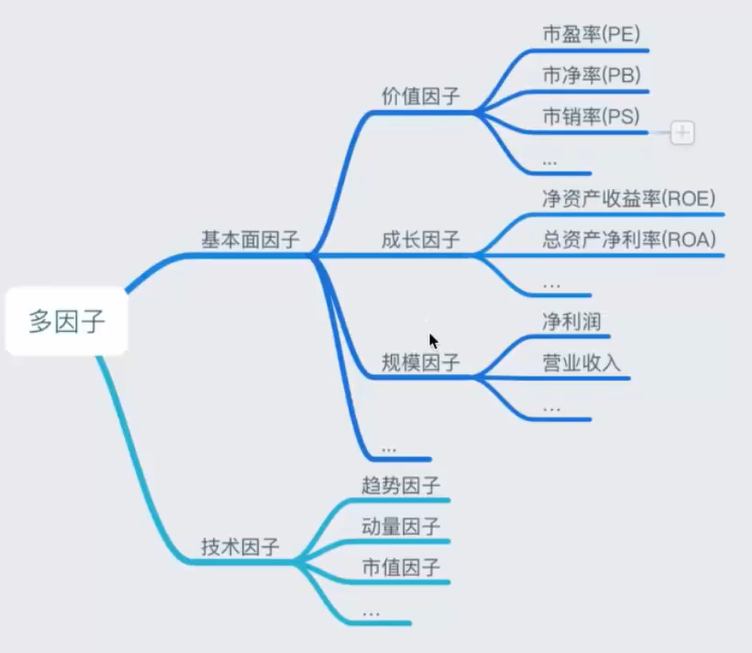

## **股票量化策略**
* 股票量化交易策略基本由两种形式，趋势交易（技术分析）和市场中性（基本面分析），经常使用的方法为多因子选股和趋势追踪
* 趋势追踪：通过交易获得超额收益
* 多因子选股策略：通过选股获得超额收益

## **Alpha and Beta**
* 一部分与市场完全相关，整个市场的平均收益率乘以一个贝塔系数，贝塔可以称为这个投资组合的系统风险
* 另一部分和整个市场无关的叫做阿尔法
* 回归方程： y总收益 = 市场表现 * beta + alpha收益

## **多因子策略**
* 找到某些影响股票收益的因子，并利用其选股
* 特征：因子  目标：股票收益
* 多因子包括基本面因子与技术因子

## **多因子理论基础**
* 资产定价模型：完全跟市场相关，无风险利率（国债）
    * 单因子模型：市场风险因子

$$r_i=r_F+\beta_i(r_M-r_F)$$
$$
r_i: 证券的收益率\\
r_F: 无风险利率\\
r_M: 市场收益率\\
r_M - r_F: 风险溢价\\
\beta: 某个公司与市场的相关性
$$

* APT模型：不仅仅跟市场相关，还跟某些特征相关，但并未指出具体特征

* FF三因子模型：市场风险溢价因子、规模因子、价值因子

* FF无因子模型：增加盈利因子和成长因子

* 广义alpha收益 = 公认的风险因子收益 + alpha收益

def init(context):
    # 在context中保存全局变量
    context.hs300 = "000300.XSHG"
    context.stock_num = 10

# before_trading此函数会在每天策略交易开始前被调用，当天只会被调用一次
def before_trading(context):
    
    q = query(
        fundamentals.eod_derivative_indicator.market_cap
        ).filter(
            fundamentals.stockcode.in_(context.hs300)
            ).order_by(
                fundamentals.eod_derivative_indicator.market_cap
                ).limit(
                    context.stock_num
                )

    context.stock_list = get_fundamentals(q).T.index

# 你选择的证券的数据更新将会触发此段逻辑，例如日或分钟历史数据切片或者是实时数据切片更新
def handle_bar(context, bar_dict):

    # bar_dict[order_book_id] 可以拿到某个证券的bar信息
    # context.portfolio 可以拿到现在的投资组合信息
    # 使用order_shares(id_or_ins, amount)方法进行落单
    # TODO: 开始编写你的算法吧！
    for stock in context.portfolio.positions.keys():
        if stock not in context.stock_list:
            order_target_percent(stock, 0)
    for stock in context.stock_list:
        order_target_percent(stock, 1.0/len(context.stock_list))

# after_trading函数会在每天交易结束后被调用，当天只会被调用一次
def after_trading(context):
    pass

